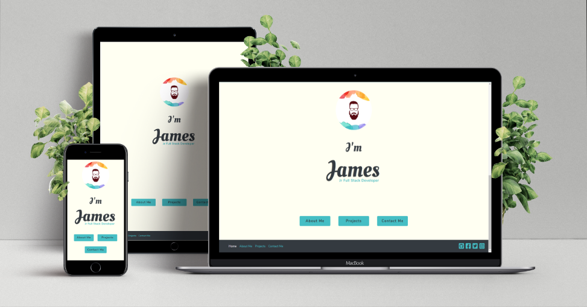

<h1 align="center"> Personal Portfolio for James Stephens </h1>

[View the live project here](https://devsteg.github.io/personal-portfolio/)

This is my personal portfolio project. It is designed to be responsive and accessible on a range of devices, making it easy to navigate for potential employers or clients.

<h2 align="center"></h2>  

<h2 align="center"></h2>

## User Experience (UX)

-   ### User Stories

    * #### Potential Employer 
        1. As a Potential Employer, I want to easily navigate through the site.
        2. As a Potential Employer, I want to be able to view the projects the developer has completed in the past.
        3. As a Potential Employer, I want to be able to find out what skills the developer has.
        4. As a Potential Employer, I want to be able to view the work history of the developer.

    * #### Potential Client 
        1. As a Potential Client, I want to be able to view the projects the developer has completed in the past.
        2. As a Potential Client, I want to be able to contact the developer with my project idea.
        3. As a Potential Client, I want to be drawn in to the website, understand the layout and overall be sure that the developer can complete my project to a high standard.  

- ### Design

    * #### Colour Scheme
        The main colours used through the website are black (#343a40), blue (#45bec4) and an off-white (#fffff2) for the background.
    * #### Typography
        The two fonts used in this project are *Nunito* and *Oleo script swash caps*. 
        The *Nunito* font is used for the main bulk of typography, with *Oleo script swash caps* being used on titles and on the landing page.
    * #### Landing Hello
        The first page to the portfolio is the landing hello title. Which is used to grab attention but also create the feeling of conversation, 
        from there they are directed down to the introduction section which continues the feeling of converstaion and reveals the navigations links around the site.
    * #### Imagery
        Logo created on Affinity designer is on the landing page and across the site in the navbar. 
        An image of the developer is also used on "About Me" to allow the user to put a face to the name.
    * #### Navigation
        The top nav bar is fixed in place to allow for quick access to the navigation links wherever the user is on the page. 
        The Navbar and footer are styled differently to the wireframes due to not needing the navigation links in the footer with the nav bar fixed to the top and for ease of use.
        While developing the project I found the footer would not sit at the bottom of the viewport when the page content didn't fill the page, 
        the solution for this was found [here](https://stackoverflow.com/questions/643879/css-to-make-html-page-footer-stay-at-bottom-of-the-page-with-a-minimum-height-b) on Stack Overflow.
    * #### Projects
        The projects page currently has existing websites that were not created by myself, they will be replaced once I have the projects to replace them with.
    * #### About Me
        I decided to add the "now you know" section towards the end of the development process as to allow the user to get to know the developer more.

- ### Wireframes

    * [Wireframes for the project are here](assets/wireframes/personal_portfolio_wireframes.pdf)
    
    * [Mobile Wireframes for the project are here](assets/wireframes/personal_portfolio_wireframes_mobile.pdf)
    
## Features

- Consistent Navigation bar and footer across the site.

- Responsive on all device sizes.

- Interactive Elements.

## Technologies Used

- ### Languages Used
    * [HTML5](https://en.wikipedia.org/wiki/HTML5)
    * [CSS3](https://en.wikipedia.org/wiki/Cascading_Style_Sheets)

- ### Frameworks, Libaries & Programs Used
    1. [Bootstrap v4.5.0:](https://getbootstrap.com/)
        * Bootstrap has been used to help with the responsiveness and styling of the website.
    2. [Google Fonts:](https://fonts.google.com/)
        * Google Fonts was used to import the fonts *Nunito* and *Oleo script swash caps* into the CSS file and both were used across the website.
    3. [Font Awesome:](https://fontawesome.com/)
        * Font Awesome was used on all pages throughout the website to add icons for aesthetic and UX purposes.
    4. [jQuery:](https://jquery.com/)
        * jQuery came with Bootstrap to make the navbar responsive.
    5. [Git:](https://git-scm.com/)
        * Git was used for version control by utilizing the Gitpod terminal to commit to Git and Push to GitHub.
    6. [GitHub:](https://github.com/)
        * GitHub was used to store the projects code after being pushed from Git.
    7. [Affinity Designer:](https://affinity.serif.com/en-gb/designer/)
        * Affinity Designer was used to create the mock-up images, and the logo.
    8. [Balsamiq:](https://balsamiq.com/)
        * Balsamiq was used to create the [wireframes](assets/wireframes/personal_portfolio_wireframes.pdf) during the design process.
    9. [Favicon.io](https://favicon.io/favicon-converter/)
        * Favicon.io was used to convert the site logo to a favicon for the website. The links for the favicon were also copied from favicon.io.

## Testing

-   The W3C Markup Validator and W3C CSS Validator Services were used to validate every page of the project.

    * [W3C CSS Validator Results](assets/testing/w3c-css-validator-results.png)
    * [W3C Markup Validator Results](assets/testing/w3c-markup-validator-results.png)

- ### Testing User Stories from User Experience (UX) Section

    * #### Potential Employer
        1. As a Potential Employer, I want to easily navigate through the site.
            * The landing page of the site directs the user down page using the down arrow icon. Which is where the user will find navigation buttons to their chosen page.
            * There are navigation links within the nav bar on every page as to not trap the user, the navigation links also highlight which page the user is on for ease of use.

        2. As a Potential Employer, I want to be able to view the projects the developer has completed in the past.
            * The landing page of the site directs the user down the page using the down arrow icon, which is where the user will find the navigation button to the projects page.
              The user can then browse the recent projects completed by the developer as well as the technologies used in creating them.
            * The project images and titles also open the live project to view in a seperate window.

        3. As a Potential Employer, I want to be able to find out what skills the developer has.
            * The developers skills are located on the about me page, the skills section uses bootstrap progress bars to indicate to the user how adept the developer is in the skill.
        
        4. As a Potential Employer, I want to be able to view the work history of the developer.
            * The work history is on the about me page. It is located underneath the skills section along with education info. 
              The user can see the pplace of work, type of work and numbers of years worked there.

    
    * #### Potential Client
        1. As a Potential Client, I want to be able to view the projects the developer has completed in the past.
            * The landing page of the site directs the user down the page using the down arrow icon, which is where the user will find the navigation button to the projects page.
              The user can then browse the recent projects completed by the developer as well as the technologies used in creating them.

        2. As a Potential Client, I want to be able to contact the developer with my project idea.
            * There is a navigation button on the landing page to the contact page. There is also a link in the nav bar which will be on every page. 
              Once on the contact page, the user will see the contact form which is where the user can input their name, email address and there is a text-area to explain their project idea.

        3. As a Potential Client, I want to be drawn in to the website, understand the layout and overall be sure that the developer can complete my project to a high standard.
            * The user is greeted with a big "Hello!" on the landing page, grabbing attention and creating the feeling of conversation. 
            * The website is clean and responsive, with a simple understandable layout.
    
- ### Further Testings

    * Tested all links work as expected and all links to external sources open in a new window.

    * Form testing, test submitted the form to test that all the fields require the correct information. 
    By doing this I realised that the *value* attribute in the input tag should of been *placeholder*.

    * When the personal info section on the about me page switches to the mobile view, 
    it was being prevented from spanning the full width of the page by the row and container fluid class brought over by bootstrap. 
    This was fixed by setting the padding & margin left and right to 0 when the screen size reaches 1024px. The inspiration (along with some trial and error) for the solution was found [here](https://github.com/twbs/bootstrap/issues/18207) on Github.
    
    * While testing the navbar hamburger toggler in mobile view I found the links were appearing the right of the button, I found this was caused by some CSS written which was deleted. 
    When the code was deleted the nav links would then push the js-logo image down underneath the links, to solve this I refactored the navbar html code so the logo appears to the left of the nav links.

    - #### Device/Browser Testing
        * Chrome
        * Firefox
        * Microsoft Edge
        * Iphone 6/7/8 plus (Chrome Dev tools)
        * Iphone X (Chrome Dev Tools)
        * Ipad Pro (Chrome Dev tools)
        * Samsung Note 20 Ultra 5G

    * My partner also tested the full site using Safari on her Macbook pro.

## Known Bugs

- When loading the web page there is flash of unstyled text (FOUT) while the site loads the font style from google fonts.

## Deployment

- The project was deployed on github pages using the following steps
    * Login to Github
    * Locate the [Github Repository](https://github.com/DevSteg/personal-portfolio)
    * Click on the "Settings" link in the top right corner of the repository
    * Scroll down the settings page until "Github Pages" section
    * Click the dropdown box in the "Source" section and select the "Master Branch"
    * Scroll back down the page after it refreshes to the now published site link in the "GitHub Pages" section.

## Credits

- [W3Schools](https://www.w3schools.com/)
- [Stack Overflow](https://stackoverflow.com/)
- [Github](https://https://github.com/)
- [Bootstrap v4.5.0:](https://getbootstrap.com/)
    * Bootstrap was used throughout the website.
    The nav bar, footer and progress bars code all came from bootstrap but were modified to meet the developers needs.
- [Pixeden:](https://www.pixeden.com/)
    * Pixeden.com was used to download the PNG file for the mock images used on the projects page as well as this README.md.
- [GoodReads](https://www.goodreads.com/quotes/646569-find-a-job-you-enjoy-doing-and-you-will-never)
    * GoodReads.com was used for the quote from Mark Twain.

## Acknowledgements

* My Mentor for helpful feedback throughout the project and working calls around my current work schedule.