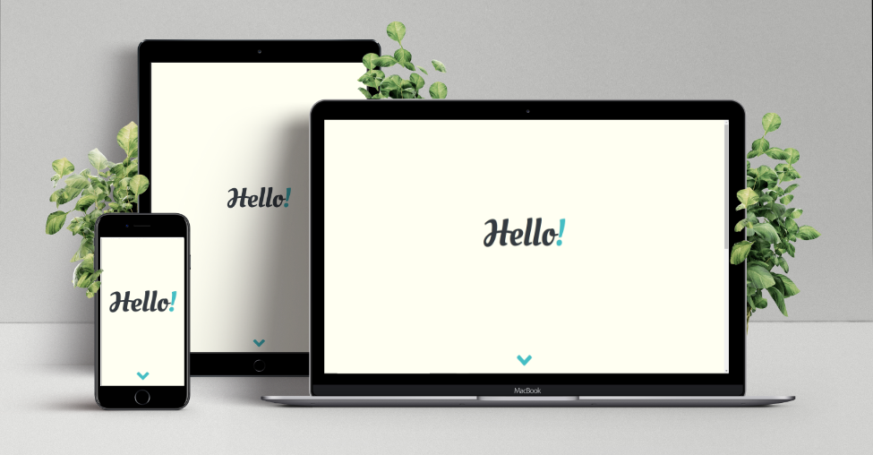

<h1 align="center"> Personal Portfolio for James Stephens </h1>

[View the live project here]()

This is my personal portfolio project. It is designed to be responsive and accessible on a range of devices, making it easy to navigate for potential employers or clients.

<h2 align="center"></h2>  

<h2 align="center"></h2>

## User Experience (UX)
---

-   ### User Stories

    * #### Potential Employer 
        1. As a Potential Employer, I want to easily navigate through the site.
        2. As a Potential Employer, I want to be able to view the projects the developer has completed in the past.
        3. As a Potential Employer, I want to be able to find out what skills the developer has.
        4. As a Potential Employer, I want to be able to view the work history of the developer.

    * #### Potential Client 
        1. As a Potential Client, I want to be able to view the projects the developer has completed in the past.
        2. As a Potential Client, I want to be able to contact the developer with my project idea.

- ### Design

    * #### Colour Scheme
        The main colours used through the website are black, blue and an off-white for the background.
    * #### Typography
        The two fonts used in this project are *Nunito* and *Oleo script swash caps*. 
        The *Nunito* font is used for the main bulk of typography, with *Oleo script swash caps* being used on titles and on the landing page.
    * #### Landing Hello
        The first page to the portfolio is the landing hello title. Which is used to grab attention but also create the feeling of conversation.
    * #### Imagery
        Logo created on Affinity designer is on the landing page and across the site in the navbar. 
        An Image of the developer is also used on About Me to allow the user to put a face to the name.

- ### Wireframes
    

## Features
---
- Responsive on all device sizes.

- Interactive Elements.

## Technologies Used
---
- ### Languages Used
    * [HTML5](https://en.wikipedia.org/wiki/HTML5)
    * [CSS3](https://en.wikipedia.org/wiki/Cascading_Style_Sheets)

- ### Frameworks, Libaries & Programs Used
    1. [Bootstrap v4.5.0:](https://getbootstrap.com/)
        * Bootstrap has been used to help with the responsiveness and styling of the website.
    2. [Google Fonts:](https://fonts.google.com/)
        * Google Fonts was used to import the fonts *Nunito* and *Oleo script swash caps* into the CSS file and both were used across the website.
    3. [Font Awesome:](https://fontawesome.com/)
        * Font Awesome was used on all pages throughout the website to add icons for aesthetic and UX purposes.
    4. [jQuery:](https://jquery.com/)
        * jQuery came with Bootstrap to make the navbar responsive.
    5. [Git:](https://git-scm.com/)
        * Git was used for version control by utilizing the Gitpod terminal to commit to Git and Push to GitHub.
    6. [GitHub:](https://github.com/)
        * GitHub was used to store the projects code after being pushed from Git.
    7. [Pixeden:](https://www.pixeden.com/)
        * Pixeden.com was used to download the PNG file for the mock images used on the projects page as well as this README.md.
    8. [Affinity Designer:](https://affinity.serif.com/en-gb/designer/)
        * Affinity Designer was used to create the mock images, and the logo.
    9. [Balsamiq:](https://balsamiq.com/)
        * Balsamiq was used to create the [wireframes](https://github.com/) during the design process.

## Testing
---

- ### Testing User Stories from User Experience (UX) Section

    * #### Potential Employer
        1.
        2.
        3.
    
    * #### Potential Client
        1.
        2.
        3.
    
- ### Further Testing

    * Form testing, test submitted the form to test that all the fields require the correct information. 
    By doing this I realised that the *value* attribute in the input tag should of been *placeholder*.

- ### Known Bugs

## Deployment
---

## Credits
---

- [W3Schools](https://www.w3schools.com/)
- [Stack Overflow](https://stackoverflow.com/)
